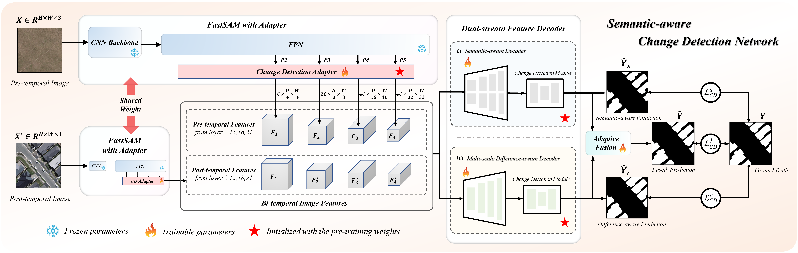
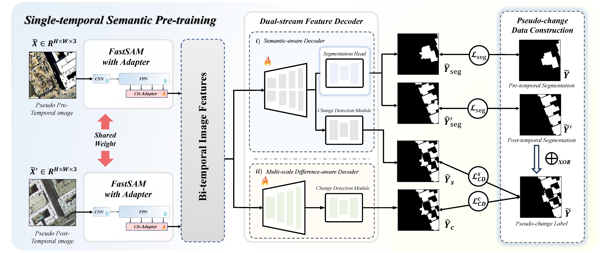
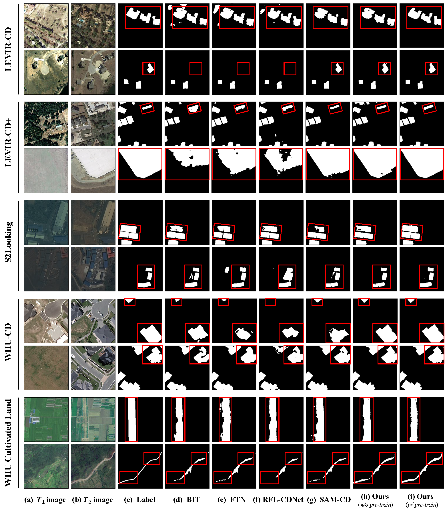

<h1 align="center">
    Detect Changes like Humans: Incorporating Semantic Priors for Improved Change Detection
</h1></h1> 
<p align="center">
<a href="https://arxiv.org/abs/2412.16918"></a>
<a href="https://github.com/DREAMXFAR/SA-CDNet"></a>
<a href="https://github.com/DREAMXFAR/SA-CDNet/network/members"></a>
<a href="https://github.com/DREAMXFAR/SA-CDNet/stargazers"></a>
<a href="https://github.com/DREAMXFAR/SA-CDNet/issues"></a>
<a href="https://github.com/DREAMXFAR/SA-CDNet/blob/master/LICENSE.txt"></a>
</p>

> Yuhang Gan, Wenjie Xuan, Zhiming Luo, Lei Fang, Zengmao Wang, Juhua Liu, Bo Du

This is the official implementation for Semantic-Aware Change Detection network, namely SA-CDNet, which transfers the common knowledge of the visual foundation models to change detection. Moreover, a single-temporal semantic pre-training strategy is proposed to enrich the semantic prior of the network. **[Under Review]**


## :fire: News

- **[2025/01/10]**: Codes for training and inference are released. 


## :round_pushpin: Todo

- [x] Release training and inference codes. Instructions on dataset preparation and checkpoints are also provided. 


## :sparkles: Highlight

- **A semantic-aware change detection network, namely SA-CDNet.** We propose an advanced SA-CDNet for change detection, which inherits the rich knowledge of natural images from the vision foundation model and adapts these semantic priors to remote sensing change detection. Additionally, a dual-stream feature decoder is derived to mimic the human visual paradigm, which integrates semantic-aware and difference-aware features for robust predictions. 
- **A well-designed single-temporal semantic pre-training strategy.** To relieve the scarcity of annotated change detection data, we construct pseudo-change detection data from remote sensing semantic segmentation datasets to pre-train the network. Based on our SA-CDNet, an extra segmentation branch is introduced for improved semantic understanding through discriminating landscapes in single-temporal images.
- **Extensive experiments on five challenging benchmarks. ** We conducted experiments on five benchmarks including LEVIR-CD, LEVIR-CD+, S2Looking, WHU-CD for building changes, and the WHU Cultivated Land for farmland changes. Our method achieves SOTA performance on all datasets. Comprehensive ablation studies proved the effectiveness of our model and pre-training strategy.


## :memo: Introduction

- The architecture of our proposed SA-CDNet, which comprises of a vision foundation model-based feature encoder with change detection adapter, and a dual-stream feature decoder to combine semantic-aware and difference-aware features for robust change detection. 

  

- Our single-temporal semantic pre-training strategy, where we construct pseudo-change detection data from remote sensing semantic segmentation datasets as the pre-training dataset, and an additional single-temporal semantic segmentation task is introduced into the pre-training to improve the semantic understanding of bi-temporal images. 

  


## :hammer_and_wrench: Install

**Recommended**:  `Python=3.7` `torch=1.9.0` `CUDA=11.7` 

```shell
# set up repository 
git clone https://github.com/thislzm/SA-CDNet.git
cd SA-CDNet-master

# install conda environment 
conda create -n sacdnet python=3.7
conda activate sacdnet

pip install -r requirements.txt
```


## :pushpin: Checkpoints

You can download the following checkpoints and put them in `checkpoints/` and `fastsam_model/`.

| Model                  | Baidu Yun                                                    | Notations                                                    |
| ---------------------- | ------------------------------------------------------------ | ------------------------------------------------------------ |
| FastSAM                | [link](https://pan.baidu.com/s/1lS3gPNU6FkTY3uFEAj_ITA?pwd=lzms) | Pre-trained FastSAM models.                                  |
| SA-CDNet (pre-trained) | [link](https://pan.baidu.com/s/1otiGilbOmgzeATVerx7LSQ?pwd=lzms) | Our SA-CDNet pre-trained on pseudo-change data.              |
| SA-CDNet (fine-tuned)  | [link](https://pan.baidu.com/s/1JrX2jMrJIQJniEg2w0-sog?pwd=lzms) | Our final SA-CDNet after fine-tuning on change detection data. |


## :rocket: Getting Started

> Here we suppose you are in `SA-CDNet-master/`

#### File Structure

-   The whole project is supposed to organized as follows. 

    ```shell
    # directory 
    SA-CD
    ├── checkpoints  # model checkpoints, need to download model checkpoints
    │   ├── SANet 
    │   │   ├── LEVIR
    │   │   │   ├── no_pretrain.pth
    │   │   │   └── with_pretrain.pth
    │   │   ├── LEVIR+
    │   │   │   ├── no_pretrain.pth
    │   │   │   └── with_pretrain.pth
    │   │   ├── S2Looking
    │   │   │   ├── no_pretrain.pth
    │   │   │   └── with_pretrain.pth
    │   │   ├── WHU
    │   │   │   ├── no_pretrain.pth
    │   │   │   └── with_pretrain.pth
    │   │   └── WHU_CUL
    │   │       ├── no_pretrain.pth
    │   │       └── with_pretrain.pth
    │   └── pre_train  # pre-trained models
    │       ├── Building
    │       │   └── pretrain_Building.pth
    │       └── Cultivalted land
    │           └── pretrain_cultivalted.pth
    ├── datasets  # data loader
    │   ├── Levir_CD.py
    │   ├── Levir_CD2.py
    │   ├── data_utils.py
    │   ├── data_utils2.py
    │   ├── pre_CD.py
    │   ├── pre_CD2.py
    │   └── pre_CD3.py
    ├── fastsam_model  # checkpoints of vision foundation models, also need to download
    │   ├── FastSAM-s.pt
    │   └── FastSAM-x.pt
    ├── models  # model definitions 
    │   ├── FastSAM
    │   ├── SAM_Fusion2.py
    │   └── preSAM_SNUNet4.py
    ├── pretrain.py
    ├── train.py
    ├── eval.py
    ├── ultralytics
    └── utils
    ```

​	

#### Date Preparation

1. Download the datasets first. Here we release all the datasets we used for pre-training and fine-tuning. Specifically, the single temporal semantic segmentation datasets are used to construct pseudo-change data for pre-training and change detection datasets are used for fine-tuning. 

   | Dataset                      | Baidu Yun                                                    | Dataset Category                     |
   | ---------------------------- | ------------------------------------------------------------ | ------------------------------------ |
   | `LEVIR`                      | [link](https://pan.baidu.com/s/11W6Obog_mQm6kXfwfpuKDQ?pwd=lzms) | change detection                     |
   | `LEVIR+`                     | [link](https://pan.baidu.com/s/1IRfqsIka7PpHEiGWkTh01Q?pwd=lzms) | change detection                     |
   | `S2Looking`                  | [link](https://pan.baidu.com/s/1UT1weZqiUgjdg68yuAgSJQ?pwd=lzms) | change detection                     |
   | `WHU-CD`                     | [link](https://pan.baidu.com/s/1g2y2wYnx7OIjIkARu5eAfg?pwd=lzms) | change detection                     |
   | `WHU Cultivate Land Dataset` | [link](https://pan.baidu.com/s/1lIooiYua3wwe4ec-9Zs7Wg?pwd=lzms) | change detection                     |
   | `WHU-Building`               | [link](https://pan.baidu.com/s/1qnrWS-0UfVlsSJpPpAodIQ?pwd=lzms) | remote-sensing semantic segmentation |
   | `INRIA-Building`             | [link](https://pan.baidu.com/s/1f1Q1PnjEQp3PtxlkCNFTgg?pwd=lzms) | remote-sensing semantic segmentation |
   | `LoveDA`                     | [link](https://aistudio.baidu.com/datasetdetail/55681)       | remote-sensing semantic segmentation |
   | `DLCCC`                      | [link](https://aistudio.baidu.com/datasetdetail/55681)       | remote-sensing semantic segmentation |
   | `AIRS`                       | [link](https://aistudio.baidu.com/datasetdetail/74274)       | remote-sensing semantic segmentation |

   


#### Pre-training

1. Configure the dataset path in the following files. 

    ```shell
    # for single dataset, in ./datasets/pre_CD.py, line 16
    root = "path/to/pretraining/dataset"
    
    # for two datasets, in ./datasets/pre_CD2.py, line 16, 17
    root1 = "/path/to/the/first/dataset"
    root2 = "/path/to/the/second/dataset"
    
    # for three datasets, in ./datasets/pre_CD3.py, line 16
    root1 = "<path_to_first_dataset>"
    root2 = "<path_to_second_dataset>"
    root3 = "<path_to_third_dataset>"
    ```

2. Update the model path of FastSAM in the following files. 

    ```shell
    # ./models/preSAM_SUNNet4.py, line 235
    model_name: str = '/path/to/fastsam_model/FastSAM-x.pt'
    
    # ./models/SAM_Fusion2.py, line 160
    model_name: str = '/path/to/fastsam_model/FastSAM-x.pt'
    ```

3. Update the directory path of save models in the following file. 

    ```shell
    # ./pretrain.py, line 22 and 26
    NET_NAME = '/path/of/model/name'
    DATA_NAME = '/path/of/data/name'
    
    # more detailed pre-training settings like lr are listed in line 29. 
    ```


​	

#### 	Fine-tuning

1.   Update the path of datasets in the following file. 

     ```shell
     # ./datasets/Levir_CD.py, line 16
     root = '/path/of/dataset'  # data path
     ```

2.   Configure the pathes and parameters for training. 

     ```shell
     # the parameter settings for training, in ./train.py 
     # the path of saved models, in line 20 and 24
     NET_NAME = '/path/of/model/name' 
     DATA_NAME = 'path/of/data/name'
     
     # enable to load pre-trained models, line 40
     'load_premodel': True 
     
     # the path of pre-trained models, line 43
     'chkpt_path': '/path/to/pretrain/model',  # pretrain model path
     
     # more detailed training settings like lr are listed in line 26. 
     ```

3.   Configure the validation settings. 

     ```shell
     # the parameter settings for validation, in ./eval.py
     # the model save path, in line 19 and 22
     NET_NAME = '/path/of/model/name' 
     DATA_NAME = '/path/of/data/name'
     
     # the model name for validation, in line 38, 42
     'chkpt_path': '/path/to/ckpt',
     'load_path': '/path/to/load/data', 
     ```

4.   To inference, you can use the validation codes. 

​	

## :chart_with_downwards_trend: Performance

1. **Quantitative results.**  The performance of the proposed method is evaluated with and without pretraining on multiple public datasets. Results are presented in terms of Precision (P), Recall (R), and F1-Score (F1).

   <table>
     <tr>
       <td colspan="1" rowspan="1">Datasets</td>
       <td colspan="1" rowspan="1">Methods</td>
       <td colspan="1" rowspan="1">P(%)</td>
       <td colspan="1" rowspan="1">R(%)</td>
       <td colspan="1" rowspan="1">F1(%)</td>
     </tr>
     <tr>
       <td colspan="1" rowspan="2">LEVIR</td>
       <td colspan="1" rowspan="1">SA - CD w/o pretrain</td>
       <td colspan="1" rowspan="1">92.69</td>
       <td colspan="1" rowspan="1">89.66</td>
       <td colspan="1" rowspan="1">91.15</td>
     </tr>
     <tr>
       <td colspan="1" rowspan="1">SA - CD w/ pretrain</td>
       <td colspan="1" rowspan="1">91.77</td>
       <td colspan="1" rowspan="1">91.28</td>
       <td colspan="1" rowspan="1">91.53</td>
     </tr>
     <tr>
       <td colspan="1" rowspan="2">LEVIR +</td>
       <td colspan="1" rowspan="1">SA - CD w/o pretrain</td>
       <td colspan="1" rowspan="1">86.88</td>
       <td colspan="1" rowspan="1">79.15</td>
       <td colspan="1" rowspan="1">82.83</td>
     </tr>
     <tr>
       <td colspan="1" rowspan="1">SA - CD w/ pretrain</td>
       <td colspan="1" rowspan="1">85.55</td>
       <td colspan="1" rowspan="1">83.44</td>
       <td colspan="1" rowspan="1">84.43</td>
     </tr>
     <tr>
       <td colspan="1" rowspan="2">S2Looking</td>
       <td colspan="1" rowspan="1">SA - CD w/o pretrain</td>
       <td colspan="1" rowspan="1">81.25</td>
       <td colspan="1" rowspan="1">54.73</td>
       <td colspan="1" rowspan="1">65.40</td>
     </tr>
     <tr>
       <td colspan="1" rowspan="1">SA - CD w/ pretrain</td>
       <td colspan="1" rowspan="1">81.28</td>
       <td colspan="1" rowspan="1">56.24</td>
       <td colspan="1" rowspan="1">66.48</td>
     </tr>
     <tr>
       <td colspan="1" rowspan="2">WHU</td>
       <td colspan="1" rowspan="1">SA - CD w/o pretrain</td>
       <td colspan="1" rowspan="1">94.66</td>
       <td colspan="1" rowspan="1">91.22</td>
       <td colspan="1" rowspan="1">92.91</td>
     </tr>
     <tr>
       <td colspan="1" rowspan="1">SA - CD w/ pretrain</td>
       <td colspan="1" rowspan="1">95.29</td>
       <td colspan="1" rowspan="1">93.67</td>
       <td colspan="1" rowspan="1">94.47</td>
     </tr>
     <tr>
       <td colspan="1" rowspan="2">WHU Cultivate Land</td>
       <td colspan="1" rowspan="1">SA - CD w/o pretrain</td>
       <td colspan="1" rowspan="1">72.65</td>
       <td colspan="1" rowspan="1">73.93</td>
       <td colspan="1" rowspan="1">73.28</td>
     </tr>
     <tr>
       <td colspan="1" rowspan="1">SA - CD w/ pretrain</td>
       <td colspan="1" rowspan="1">77.74</td>
       <td colspan="1" rowspan="1">72.82</td>
       <td colspan="1" rowspan="1">75.20</td>
     </tr>
   </table>

2. **Qualitative results.**  Visualized comparisons with existing SOTA methods on five benchmark change detection datasets. 

   


## :bulb: FAQs

- [x] None


## 💗 Acknowledgements

- Our implementation is greatly based on the [FastSAM](https://github.com/CASIA-IVA-Lab/FastSAM), [SAM-CD](https://github.com/DingLei14/SAM-CD), Thanks for their wonderful works and all contributors.


## :black_nib: Citation

If you find our findings helpful in your research, please consider giving this repository a :star: and citing:

```bibtex
@misc{gan2024detectchangeslikehumans,
      title={Detect Changes like Humans: Incorporating Semantic Priors for Improved Change Detection}, 
      author={Yuhang Gan and Wenjie Xuan and Zhiming Luo and Lei Fang and Zengmao Wang and Juhua Liu and Bo Du},
      year={2024},
      eprint={2412.16918},
      archivePrefix={arXiv},
      primaryClass={cs.CV},
      url={https://arxiv.org/abs/2412.16918}, 
}
```
